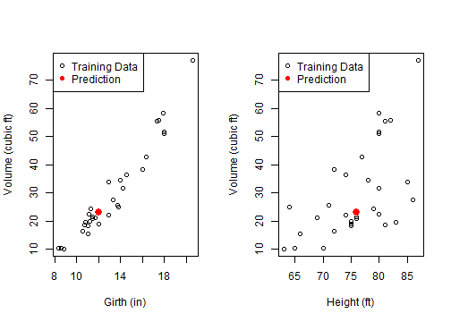

## Model


If we approximated a tree to a cylinder, we would have:
$$
\huge { Volume = Constant \times Height \times Girth^{2} }
$$
Taking the log:
$$
\huge { log(Volume) = Constant^{\prime} + log(Height) + 2 . log(Girth) }
$$

So we fit (non-reactively) a log-linear model of the volume, which gives us coefficients close to what we'd expect:


```r
data(trees)
fit <- lm(log(Volume) ~ log(Height) + log(Girth), data=trees )
fit$coefficients
```

```
## (Intercept) log(Height)  log(Girth) 
##   -6.631617    1.117123    1.982650
```


---

## Reactive inputs

The application has two numeric inputs, where we enter the height and girth of the tree whose volume we want to predict.

For example, a height and girth of $\LARGE{76ft}$ and $\LARGE{12in}$ gives us a predicted volume of $\LARGE{ 22.94 ft^3 }$.

---

## Results

The prediction is reactively calculated once:

```r
prediction <- reactive(exp(predict(fit, data.frame(Girth=input$girth, Height=input$height))))
```
and displayed on two plots (Volume ~ Girth and Volume ~ Height), in relation with the data.


